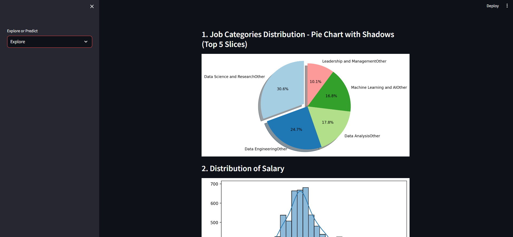
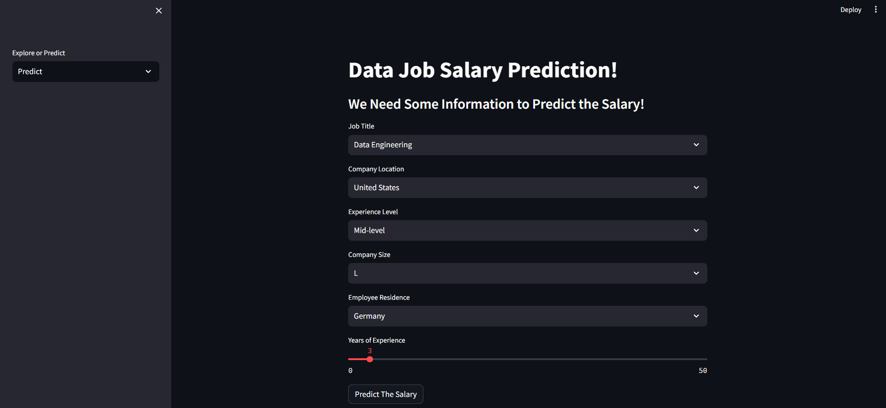

## Data Job Salary Prediction Data Science Project.📊

### This project aims to predict if the Data Jobs Salary Predictiom Regression.

#### *Implemented ML and Streamlit project leveraging a data job dataset to predict salaries for various data positions in USD. Utilized Decision Tree and Linear Regression models for accurate predictions. Deployed the model seamlessly into a Streamlit web app with an Explore page for data exploration and a Prediction page for forecasting salaries. Key features for prediction include job category, employee residence, experience level, employment type, company location, and company size.*

The project involves predicting salary categories based on various features using a pre-trained machine learning model. The following files are included:

- *Dataset:* Dataset containing unique values for different features.
- *README.md:* This file with project documentation.
- *Data_Salary_prediction.ipynb:* Jupyter Notebook with exploratory data analysis (EDA), data preprocessing, and model selection.
- *saved_steps.pkl:* Pre-trained machine learning model stored as a pickle file.
- *app.py:* Python script using Streamlit to create a web app for deploying the model.
- *requirements.txt:* File specifying the project dependencies.

## Getting Started

1. *Clone the Repository:*
   bash
   git clone https://github.com/sahermuhamed1/Data-Jobs-Salary-Prediction-Project/edit/main/README.md
   cd Income-Salary-Prediction
   

2. *Install Dependencies:*
   bash
   pip install -r requirements.txt
   

3. *Run the Web App:*
   bash
   streamlit run py.py
   

   Visit the displayed URL in your web browser to interact with the salary prediction web app.

## Usage

1. The Jupyter Notebook (Data_Salary_prediction.ipynb) provides insights into data analysis, preprocessing, and model selection.

2. The Python script (app.py) uses Streamlit to create a user-friendly web app for predicting salary categories based on user input.

3. The pre-trained model (saved_steps.pkl) is used for making predictions in the web app.

4. Explore the dataset (dataset) for a better understanding of the data.

## Web App Usage

1. After running the web app, adjust sliders and dropdowns to input user-specific features.
2. Observe the predicted income category based on the selected features.

## Web App Deployment

Explore the salary prediction web app hosted [here](https://ziadmostafa1-data-jobs-salary-prediction-project1-app-wyojqe.streamlit.app/). 

## Kaggle Notebook

Explore the Kaggle notebook used for this project [here](https://www.kaggle.com/code/nextmillionaire/data-jobs-salary-prediction-regression).

## Contact Information

### For inquiries or collaboration, feel free to reach out to the project contributors:-

LinkedIn: [Here](https://www.linkedin.com/in/sahermuhamed/)

Email: sahermuhamed176@gmail.com

Feel free to explore and enhance this project!
